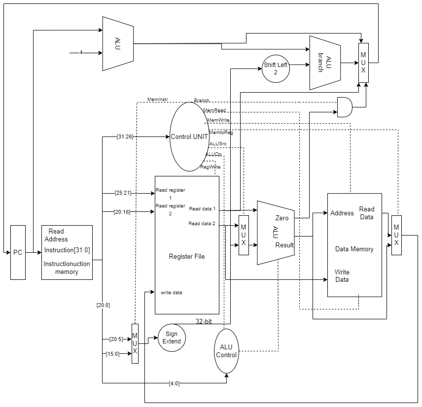
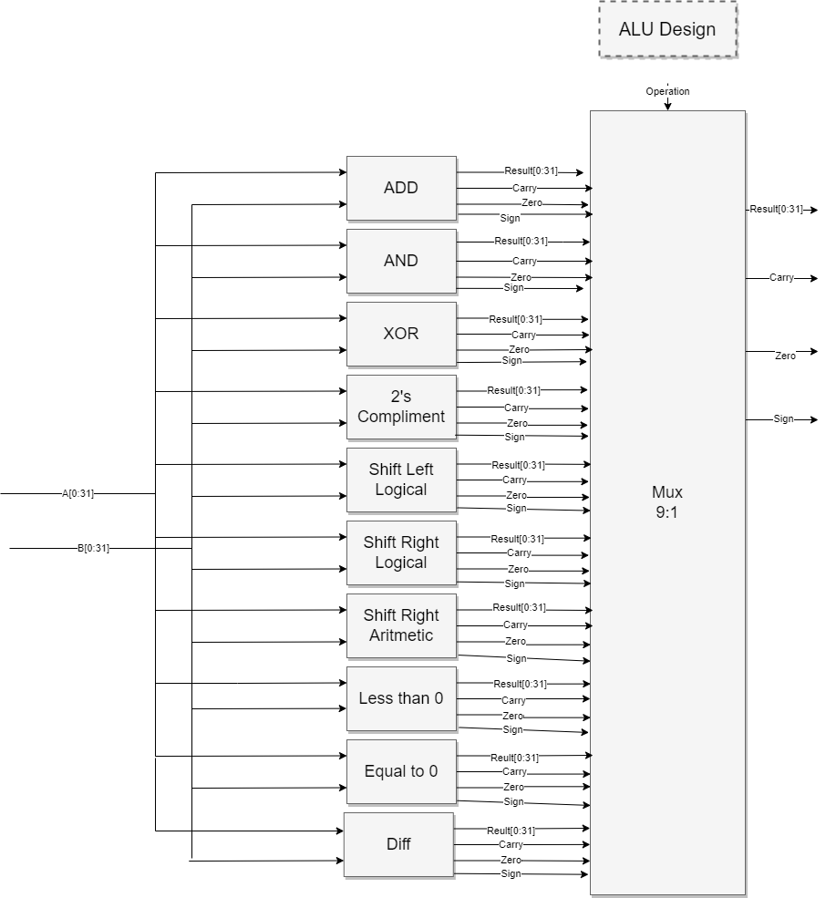

# RISC Processor Implemented Using Verilog

The KGP-RISC project is a hardware implementation of a Reduced Instruction Set Computer (RISC) architecture. The goal of the project is to design a simple, yet efficient computer architecture that can perform a variety of tasks using a limited set of instructions. The project has been implemented using Verilog Hardware Description Language (HDL) and it includes the design and implementation of the processor, the instruction set architecture (ISA), the memory, and the input/output (I/O) system.

The RISC architecture is characterized by its simple and streamlined instruction set, which allows for faster execution times and greater efficiency. The instruction set includes 10 classes of instructions, including arithmetic, arithmetic immediate, shift, shift with variable, memory access, and branching instructions. The instructions are encoded using a 6-bit opcode format and a 5-bit function code. 

The processor includes an Arithmetic Logic Unit (ALU), which performs arithmetic and logic operations, and a control unit, which controls the flow of data and instructions through the processor. The ALU is implemented using a multiplexer control that allows for efficient selection of different operations. 

The memory system includes separate data and instruction memories, which are used for storing program instructions and data. Memory is implemented using XILINX ISE's Block RAM (BRAM) modules.

More information about the project can be found in the [project report](RISC22_Report.pdf).

## Top Level Design

## ALU Design
